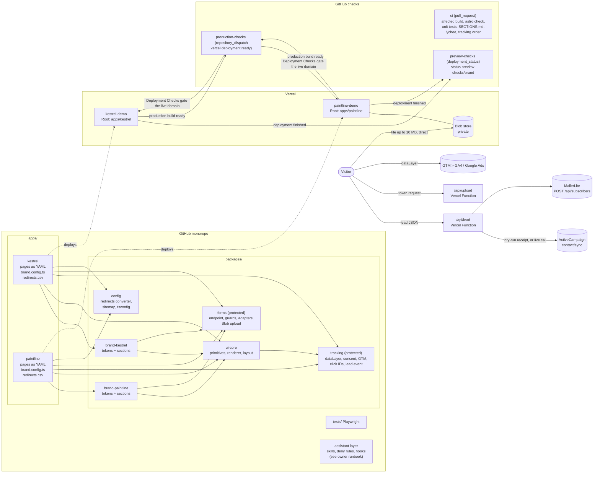

# Architecture

One pnpm + Turborepo monorepo. Each brand is an Astro app deployed as its own Vercel project
(Root Directory `apps/<brand>`). Shared packages hold everything that must behave the same on
every brand: tracking, forms, the page renderer and the CI contract.

## How a page is built

- Every page is a YAML entry in `apps/<brand>/src/content/pages/`. The file path is the URL.
- `src/content.config.ts` validates each entry against the brand's page schema: a Zod
  discriminated union of that brand's sections, plus page rules (title and description
  lengths, exactly one H1 section and it comes first, no unknown keys). Invalid data fails
  `astro build`, so it fails CI and the Vercel build.
- One catch-all route, `src/pages/[...slug].astro`, renders every entry statically with
  `@platform/ui-core/PageRenderer`, which maps each section `type` to its component.
- `apps/<brand>/SECTIONS.md` is generated from the schemas (`pnpm sections`) and CI fails
  if it is stale. It is the catalog the page skills read.
- Tailwind v4: each app's `global.css` imports Tailwind, the brand's `@theme` tokens, and
  registers each shared package with `@source`, because Tailwind does not scan
  `node_modules` or git-ignored paths and workspace packages are linked there.

## Tracking contract (`packages/tracking`)

Order in `<head>`, covered by a unit test, a CI check on the built HTML (with a GTM ID set)
and a Playwright test on every preview:

1. `dataLayer` init with `site_env` (from Vercel's `PUBLIC_VERCEL_ENV` at build time) and `brand`
2. `gtag('consent', 'default', ...)` for `ad_storage`, `ad_user_data`, `ad_personalization`,
   `analytics_storage`: region defaults from `brand.config.ts` first, then the fallback, each
   with `wait_for_update: 500`; then `url_passthrough` and `ads_data_redaction`; then a
   consent `update` from the visitor's stored choice (consent mode does not persist it)
3. The GTM snippet, only when `PUBLIC_GTM_ID` is set, with an optional first-party loader
   host per brand (`tracking.gtmHost`). The `noscript` iframe is the first thing in `<body>`.

Click IDs: `gclid`, `gbraid`, `wbraid` and `utm_*` are read from the landing URL and always
written into the form's hidden fields on that page. They are stored (localStorage, 90 days)
only after the visitor grants `ad_storage` in the banner; rejecting clears them. With
`url_passthrough`, Google tags carry click IDs on internal links when storage is denied.

`generate_lead` is pushed only after the lead endpoint confirms the submission.
`docs/GTM-SETUP.md` maps it to GA4 and to the Google Ads conversion with a blocking trigger
for every `site_env` other than `production`.

## Forms (`packages/forms`)

- One endpoint per brand, `src/pages/api/lead.ts`, `prerender = false` (a Vercel Function).
- Guards: honeypot field `website`, minimum 3 seconds between page load and submit, maximum
  24 hours, then Zod validation with friendly field messages.
- Provider per brand in `brand.config.ts`:
  - `activecampaign`: one `POST {account API URL}/api/3/contact/sync` with `Api-Token`,
    `fieldValues` by numeric field ID, `tags` by name and `lists` by numeric ID.
  - `mailerlite`: `POST https://connect.mailerlite.com/api/subscribers` with a Bearer token,
    `fields` by key and `groups` by ID. The upsert takes no tags, so tags go into a text field.
  - Both honour `Retry-After` on 429, capped at 5 seconds in total so a Function never hangs.
- Environment routing: `VERCEL_ENV !== 'production'` means the TEST list or group plus the
  `preview-test` tag. Production uses the LIVE IDs. All IDs in this demo are placeholders.
- `FORMS_MODE`: anything but `live` is dry-run. The endpoint builds the exact provider
  request, redacts secret headers and returns it as a receipt the page displays. Setting
  `FORMS_MODE=live` plus the provider secrets on a Vercel project sends for real with the same
  code path (covered by unit tests with a mocked `fetch`; not exercised live in this demo).
- Uploads (Paintline): the browser uploads straight to a **private** Vercel Blob store with a
  client token from `/api/upload`, because Function request bodies are capped at 4.5 MB. The
  token enforces 10 MB and PDF/PNG/JPEG, and the token route applies the same honeypot and
  time checks. The Blob URL travels with the lead as `attachment_url`.

## Preview versus production

| | Preview (every PR) | Production (`main`) |
| --- | --- | --- |
| `site_env` | `preview` | `production` |
| Forms | TEST list/group, tag `preview-test` | LIVE list/group |
| Google Ads conversion | Blocked in GTM by the exception trigger, and asserted by Playwright (zero Ads requests) | Fires on `generate_lead` |
| Visible badge | "Preview build" | none |
| Checks | `preview-checks/<brand>` commit status | `production-checks` via Vercel Deployment Checks |
| Canonical URLs | point at the production domain | production domain |

## CI and merge rules

- `ci` (pull_request): works out affected brands with the same rule Vercel uses (a file in a
  workspace package affects the apps that depend on it; a file outside every package is a
  global change), posts `preview-checks/<brand>` = success "not affected" for the others,
  checks `SECTIONS.md`, runs `turbo run build check test` for the affected brands and every
  package they depend on, runs lychee on the built
  HTML, and re-builds with a dummy GTM ID to check the head order.
- `preview-checks` (deployment_status, success only): derives the brand from the deployment
  environment name, posts a pending status, runs that brand's Playwright project against the
  deployment URL and posts success or failure. Statuses are keyed by context, so one brand's
  run never overwrites the other's.
- `production-checks` (repository_dispatch `vercel.deployment.ready`, production only): runs the
  same suite against the new production build and reports through
  `vercel/repository-dispatch/actions/status`, which Vercel Deployment Checks wait for before
  moving the live domain.
- Branch protection on `main`: PR required, required statuses `ci`,
  `preview-checks/kestrel`, `preview-checks/paintline`, administrators included, no
  required approvals (single-owner demo).

## Vercel projects

- Root Directory per brand, "Include files outside the root directory" on, and
  "Skip deployments when there are no changes to the root directory or its dependencies" on.
  Unique package names and declared `workspace:*` dependencies let Vercel skip a brand a
  commit does not affect.
- Node 24 (`engines`, `.nvmrc`); pnpm pinned with `packageManager` plus
  `ENABLE_EXPERIMENTAL_COREPACK=1` on each project.
- Redirects: `redirects.csv` in Webflow's export format is converted to Astro `redirects`
  with status 301 (the Vercel adapter serves them as real 301s; a `vercel.json` rule with
  `permanent: true` would be a 308). Webflow's `%` escapes and a trailing `(.*)` wildcard
  are converted.
- Trailing slashes: `trailingSlash: 'never'`. The adapter builds directory-format output, and
  on Vercel `/contact/` answers **308** with `Location: /contact`, while `/contact` answers 200.
  Recorded by a Playwright test on every preview.

## Security notes

- No secrets in the repo. Provider keys would be Vercel environment variables read at
  runtime with `getSecret`; the Blob token is created and injected by Vercel.
- Dry-run receipts redact `Api-Token` and `Authorization`.
- Customer uploads go to a private Blob store with random suffixes; URLs are not readable
  without a token.
- Protected paths (tracking, forms, workflows, redirects converter, the guardrail files) are
  blocked for the assistant by deny rules and a PreToolUse hook; see the owner runbook.
- This demo keeps previews **public** so reviewers can open them. A real build keeps
  Vercel Authentication on for previews and gives CI access with **Protection Bypass for
  Automation**: store the secret as a GitHub Actions secret, pass it as
  `VERCEL_AUTOMATION_BYPASS_SECRET`, and `tests/playwright.config.ts` already sends it as the
  `x-vercel-protection-bypass` header with `x-vercel-set-bypass-cookie: true`.
- Branch protection includes administrators; owners should hold Write, not Admin, access.
